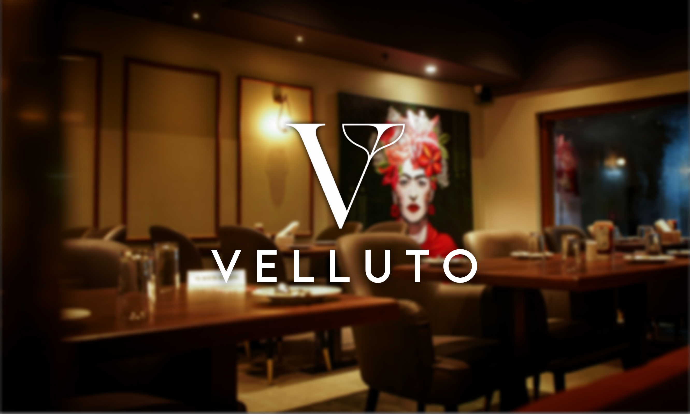

# Velluto – Elegance Served After Dark

## About the Project

Velluto is a premium restaurant website concept built to reflect elegance, intimacy, and a refined dining experience.  
The project presents a complete digital experience for a fine dining restaurant located in Galati, Romania.

The website is designed to feel smooth, modern, and immersive. Every section flows naturally into the next, creating the feeling of a real evening at Velluto — from discovering the story, to exploring signature dishes, to booking a table.

This is not just a simple restaurant presentation website. It is a full experience.

---

## What This Website Includes

### 1. Hero Section – First Impression

The homepage welcomes visitors with the slogan:

**“Elegance, served after dark.”**

It clearly presents:
- Opening hours (Mon–Sun: 18:00 – 00:00)
- Location (Galati, Romania)
- A short but powerful description of the concept
- Direct access to table booking

The design uses elegant fonts, dark tones, and gold accents to create a luxury atmosphere.

---

### 2. Our Story – The Legacy

This section presents the identity and history of Velluto.

It highlights:
- The foundation year (1985)
- The concept of “Nice Dining” – a relaxed but refined version of fine dining
- The interior atmosphere and design philosophy
- 40 years of culinary excellence

The layout uses animated cards and vertical typography to create a strong visual impact.

---

### 3. Signature Dishes – The Masterpieces

This section showcases the restaurant’s most iconic dishes.

Each dish includes:
- Image (and video preview for the main signature)
- Weight
- Price
- Full ingredient description
- Recommended wine pairing (where applicable)

The presentation is interactive and modern, focusing on visual storytelling.

---

### 4. Interactive Menu Experience

The menu is not just a list.

It includes:
- A dynamic category carousel
- Smooth transitions between dishes
- Large dish images
- Detailed descriptions
- Weight, calories, preparation time
- Price display
- Quick actions:
  - Book a table
  - Order via Glovo

The design is responsive and optimized for both desktop and mobile devices.

---

### 5. Reservation System – Full Booking Flow

One of the most advanced parts of the website.

The booking process includes 5 steps:

1. Select the experience (Main Hall, Private Cellar, Chef’s Table)
2. Choose date and number of guests
3. Select time and preferred atmosphere
4. Add optional extras (Champagne, Caviar, Roses)
5. Enter personal details and confirm

It provides a premium, guided experience instead of a basic form.

---

### 6. Contact Section

The contact area is split into four professional categories:

- Private Events
- Press & Media
- Careers
- Executive Contact

Each category opens a dedicated form, keeping the communication structured and elegant.

---

## Technologies Used

- HTML5
- CSS3
- Tailwind CSS
- JavaScript
- GSAP (animations)
- Lenis (smooth scrolling)
- Phosphor Icons

The website focuses heavily on smooth animations, layered backgrounds, and modern UI transitions.

---

## Design Philosophy

The entire website follows three main principles:

- **Elegance** – Dark background, gold accents, refined typography.
- **Immersion** – Smooth animations and cinematic transitions.
- **Experience First** – Every interaction feels intentional and premium.

---

## Purpose of the Project

This project can be used as:

- A portfolio project
- A premium restaurant template
- A UI/UX showcase
- A modern booking system example
- A fine dining brand concept

---

## Final Notes

Velluto is more than a restaurant website.  
It is a digital representation of luxury dining.

From the first scroll to the final booking confirmation, everything is designed to feel smooth, intimate, and elegant.

---

**Author:** Velluto Project  
**Location:** Galati, Romania
